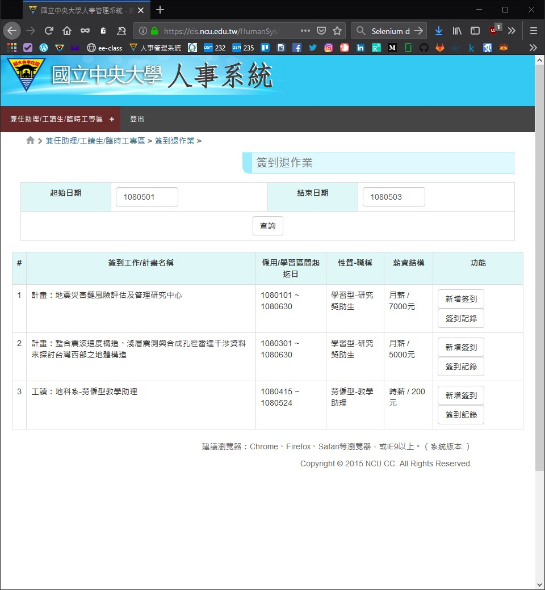

# Punch card
Selenium NCU HumanSys auto sign in/out program

Auto detect if sign in or sign out

Installation:

- Clone this repo
- conda install Selenium 
- Get [Firefox geckodriver](https://github.com/mozilla/geckodriver/releases) and put into the repo dir
- Change the studentID, studentPW and work_name, work_info in [punch.py](punch.py)

Reminder:
- Change the webdriver in [punch.py](punch.py) if you are using Chrome.
- [ChromeDriver](https://sites.google.com/a/chromium.org/chromedriver/downloads)

Task schedule:

- Windows 10
  - Edit [punch_card.bat](punch_card.bat)
  - Change the repo path
  - Change the Anaconda environment "punch_card" in the second line
  - Add [punch_card.bat](punch_card.bat) file into the Task scheduler in Windows 10
- macOS
  - Add [punch.py](punch.py) into Automator
- Ubuntu
  - Add [punch.py](punch.py) into Crontab

Helpful guides:

- [設定 Windows 工作排程定期執行 Python 爬蟲程式](https://titangene.github.io/article/set-up-windows-task-scheduler-to-periodically-execute-python-crawler.html)
- [Mac Automator](https://support.apple.com/zh-tw/guide/automator/welcome/mac)
- [Ubuntu 排程設定 ：Crontab 排程使用教學](https://jqnets.com/blog/ubuntu-%E6%8E%92%E7%A8%8B%E8%A8%AD%E5%AE%9A-%EF%BC%9Acrontab-%E6%8E%92%E7%A8%8B%E4%BD%BF%E7%94%A8%E6%95%99%E5%AD%B8/)
